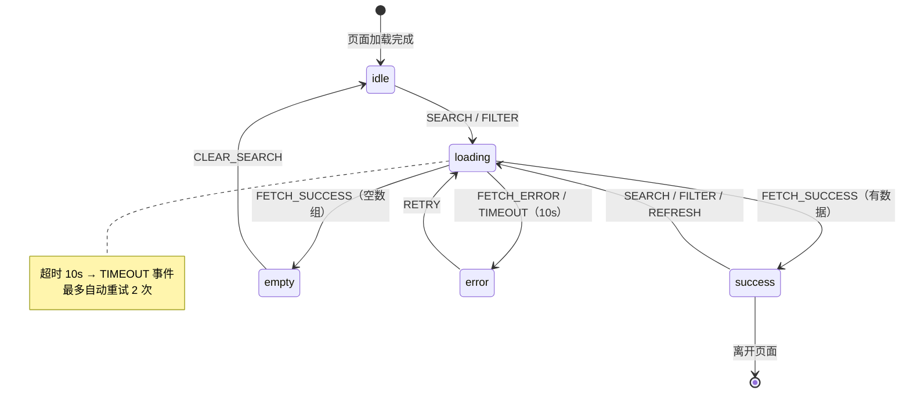

# Phase 11: 交互与状态机规范协议

## 适用场景

为每个核心页面/组件输出**形式化交互规范**：状态机定义、事件列表、转换规则、副作用、验证规则、错误恢复、Given/When/Then 验收标准。

目标：前端无需猜测任何状态流转，直接按规范实现。

---

## 输入要求

- `docs/ui/wireframes/*.md` — Phase 9 线框图（含交互注释）
- `docs/stories/` epic 文件（验收标准）
- `docs/prd.md` 中的业务规则描述

---

## 状态定义规范

每个页面/组件必须定义**完整状态集合**，最小覆盖：

```
idle            — 初始静止态，等待用户操作
loading         — 异步请求进行中
success         — 操作/加载成功
error           — 操作/加载失败
empty           — 成功态但无数据
```

根据复杂度添加：

```
editing         — 表单被修改过但未提交
validating      — 本地校验运行中
submitting      — 表单提交/API 写操作进行中
confirming      — 等待用户二次确认（危险操作）
offline         — 网络不可用
permission_denied — 权限不足
timeout         — 超时未响应
partial         — 部分成功（批量操作）
```

**禁止用布尔值组合代替状态**：
- ❌ `isLoading && !hasError && !isEmpty`
- ✅ 独立的 `loading` 状态

---

## 每个页面/组件的输出格式

### 1. 状态清单

```markdown
## 状态清单：{页面/组件名}

| 状态 | 含义 | 进入条件 | 允许的事件 |
|------|------|---------|-----------|
| `idle` | 初始态，无操作 | 页面加载完成 | SEARCH, FILTER, TAP_ITEM |
| `loading` | 列表数据请求中 | SEARCH 触发 | — (阻塞交互) |
| `success` | 列表加载成功 | API 返回 200 | SEARCH, FILTER, TAP_ITEM, SCROLL |
| `empty` | 搜索无结果 | API 返回空数组 | CLEAR_SEARCH, GO_BACK |
| `error` | 加载失败 | API 返回 4xx/5xx 或超时 | RETRY, GO_BACK |
```

### 2. 事件列表

```markdown
## 事件列表：{页面/组件名}

| 事件 | 触发方 | 触发条件 | 携带 Payload |
|------|--------|---------|-------------|
| `SEARCH` | 用户 | 点击搜索 / 回车 | `{ query: string }` |
| `FILTER` | 用户 | 切换筛选条件 | `{ filters: FilterObject }` |
| `TAP_ITEM` | 用户 | 点击列表项 | `{ itemId: string }` |
| `FETCH_SUCCESS` | 系统 | API 成功响应 | `{ items: Item[], total: number }` |
| `FETCH_ERROR` | 系统 | API 失败 / 超时 | `{ error: ErrorCode, message: string }` |
| `RETRY` | 用户 | 点击重试 | — |
```

### 3. 状态转换表

```markdown
## 状态转换：{页面/组件名}

| 当前状态 | 事件 | 下一状态 | 副作用 |
|---------|------|---------|--------|
| `idle` | `SEARCH(query)` | `loading` | 发起 API 请求 |
| `idle` | `FILTER(filters)` | `loading` | 发起 API 请求（带筛选参数） |
| `success` | `SEARCH(query)` | `loading` | 发起 API 请求 |
| `loading` | `FETCH_SUCCESS(items)` | `success` / `empty` | 渲染列表（items非空→success，空→empty） |
| `loading` | `FETCH_ERROR(error)` | `error` | 记录错误信息，停止加载 |
| `error` | `RETRY` | `loading` | 重新发起上一次 API 请求 |
| `empty` | `CLEAR_SEARCH` | `idle` | 清空搜索词，恢复默认状态 |
| `任意` | `NETWORK_OFFLINE` | `offline` | 显示网络横幅 |
| `offline` | `NETWORK_ONLINE` | ← 恢复到上一状态 | 重新请求（若之前在 loading） |
```

### 4. 副作用规格

列出所有副作用（异步操作、导航、存储）：

```markdown
## 副作用：{页面/组件名}

### 异步操作
- `fetchItems(query, filters)` → 触发 FETCH_SUCCESS 或 FETCH_ERROR
  - 超时：10 秒后强制触发 FETCH_ERROR（code: TIMEOUT）
  - 重试策略：最多 2 次自动重试（指数退避），再失败才展示错误UI

### 导航副作用
- `TAP_ITEM` → navigate(`/items/${itemId}`)

### 本地存储副作用
- 搜索词写入 searchHistory（localStorage）
- 搜索词长度 > 0 才记录

### 全局副作用
- 进入 `error` 态 → 上报错误日志（analytics.track）
```

### 5. 验证规则

```markdown
## 验证规则：{页面/组件名}

| 字段 / 操作 | 验证时机 | 规则 | 错误提示 |
|------------|---------|------|---------|
| 搜索词 | 实时 / 提交时 | 长度 1-50 字符 | "搜索词不能超过 50 字" |
| 搜索词 | 提交时 | 不允许纯空格 | "请输入有效的搜索内容" |
| 筛选条件 | 提交时 | 价格区间须满足 min ≤ max | "价格区间无效" |

验证执行顺序：
1. 空值检查
2. 格式校验（正则/类型）
3. 业务规则校验
4. 跨字段校验（inter-field validation）
```

### 6. 错误处理规格

```markdown
## 错误处理：{页面/组件名}

| 错误码 | 来源 | 用户可见消息 | 恢复操作 | 是否需要上报 |
|--------|------|------------|---------|------------|
| `NETWORK_ERROR` | 网络层 | "网络连接失败，请检查网络后重试" | [重试] | 否 |
| `TIMEOUT` | 前端超时 | "请求超时，请稍后重试" | [重试] | 是 |
| `401` | API | "请先登录" | → 登录页 | 否 |
| `403` | API | "您没有权限执行此操作" | [联系客服] | 是 |
| `404` | API | "内容不存在或已被删除" | [返回首页] | 否 |
| `500` | API | "服务器开小差了，请稍后再试" | [重试] [反馈问题] | 是 |
| `VALIDATION_ERROR` | 前端/API | 显示字段级错误 | 修正字段 | 否 |

原则：
- 所有错误必须有用户友好的中文说明
- 所有错误必须有至少一个恢复操作（不能是死路）
- 技术细节（堆栈、错误码）不暴露给用户
```

### 7. 状态机图（Mermaid）

为每个页面/组件生成 Mermaid 状态图，便于团队可视化审阅：

```markdown
## 状态机图：{页面/组件名}


```

**图示规则**：
- 每个状态一个节点
- 转换箭头标注触发事件
- 自动触发（系统）与用户触发须可区分
- 超时和网络异常作为特殊转换标注

---

### 8. Given/When/Then 验收标准

```markdown
## 验收标准：{页面/组件名}

### 成功路径

**AC-001: 正常搜索**
- Given: 用户在搜索栏输入"电焊工"
- When: 点击搜索按钮
- Then: 显示 loading 态骨架屏 → 展示匹配的工人列表，每项显示姓名/评分/距离

**AC-002: 空结果**
- Given: 搜索词"不存在的工种xxxxxxxxx"
- When: 搜索完成
- Then: 显示空态，含"暂无符合条件的工人"文案和"修改搜索词"引导按钮

### 失败路径

**AC-003: 网络断开**
- Given: 设备网络断开
- When: 用户点击搜索
- Then: 显示"网络连接失败"横幅，保留上次搜索结果（若有缓存），[重试] 按钮可见

**AC-004: 接口超时**
- Given: 接口 10 秒未响应
- When: 超时触发
- Then: 中止 loading，显示超时错误，提供 [重试] 选项

### 边界情况

**AC-005: 搜索词超长**
- Given: 用户输入超过 50 字符
- When: 用户继续输入
- Then: 超出部分被截断，显示计数提示，不触发搜索
```

---

## 边界场景处理（Edge Cases）

每个页面必须明确以下 5 类边界场景的处理策略：

```markdown
## 边界场景：{页面/组件名}

| 边界场景 | 当前表现 | 期望行为 |
|---------|---------|---------|
| **网络超时** | {默认/空白} | 超时 10s → error态 + "请求超时，请重试" + [重试] 按钮 |
| **数据部分成功** | {全量失败} | 显示已返回部分 + 警告横幅"部分数据加载失败" |
| **数据过期/脏数据** | {直接展示} | 后台静默刷新 + 更新成功后无感替换；刷新失败显示"数据可能未更新"提示 |
| **并发提交** | {重复执行} | 提交中禁用按钮（submitting态），防止二次触发 |
| **登录过期** | {API 401} | 保存当前页面状态 → 跳登录页 → 登录成功后恢复 |
| **权限不足** | {API 403} | 展示 permission_denied 态，说明为何无权限，提供申请入口（如有） |
| **设备离线** | {崩溃/空白} | 展示 offline 横幅，保留缓存数据（如有），在线后自动恢复 |
```

---

## 多步骤流程的状态机（表单 / 向导）

对于多步骤流程（注册向导、发布流程等），额外输出：

```markdown
## 流程状态机：{流程名}

**总状态**（流程级别）：
step_1_city → step_2_category → step_3_details → step_4_confirm → submitting → success | error

**每步状态**：
- 参见各 step 的组件状态机

**流程规则**：
- 前步验证未通过时，禁止前进
- 允许后退，后退不丢失已填内容
- 提交态时禁止后退（防止重复提交）
- 成功后禁止返回此流程（防止重复发布）
```

---

## 产出清单

每个页面/组件产出：`docs/ui/interaction/{页面名}-state.md`

```markdown
# 交互规范：{页面/组件名}

**生成日期**: {date}
**关联线框**: docs/ui/wireframes/{页面名}.md

## 状态清单
## 事件列表
## 状态转换表
## 副作用规格
## 验证规则
## 错误处理
## 验收标准 (Given/When/Then)
```

---

## 进入 Phase 11 的条件

- [ ] 所有 P0 页面的状态机已定义
- [ ] 所有表单的验证规则已列出
- [ ] 所有错误场景有用户可见消息和恢复选项
- [ ] 关键路径的 Given/When/Then 已写出

---

## 禁止事项

- 不用布尔值组合代替状态枚举
- 不遗漏 offline / timeout / permission_denied 状态
- 不把 API 错误消息直接显示给用户
- 不允许没有恢复路径的死路错误状态
- 不在此 Phase 输出任何视觉规格
