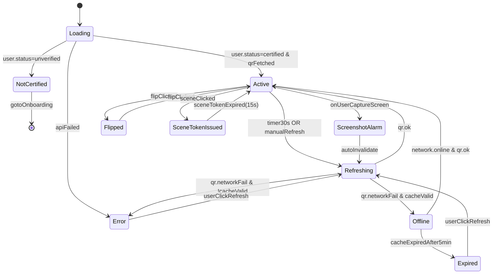

> Run: 2026-04-17-211321 | Phase: P3 | 作者: Hephaestus
> 契约来源: docs/ui/design-system.md + docs/ui/page-map.md
> M1 覆盖 US: US-008 / US-012

# 状态机 · 电子校友卡（Alumni Card State）

## 1. 状态拓扑图

## 2. 状态 / 事件 / 守卫 / 动作

| 状态 | 含义 |
|------|------|
| `Loading` | 首次打开，拉取卡面基础信息 + 首个 QR |
| `NotCertified` | 用户未完成身份认证 |
| `Active` | 正常亮码态 |
| `Refreshing` | 30s 定时或手动触发的 QR 刷新 |
| `Offline` | 离线但缓存 QR 仍在 5 分钟有效期内 |
| `Expired` | 缓存过期，强制断网失效 |
| `ScreenshotAlarm` | 检测到截图，当前 QR 立即失效 |
| `Flipped` | 卡面翻转至背面 |
| `SceneTokenIssued` | 发出场景专用短时令牌（15s） |
| `Error` | 首次加载或刷新失败且无有效缓存 |

| 事件 | 守卫 | 动作 |
|------|------|------|
| `timer30s` | `state === 'Active'` | 静默发起 `GET /campus-card/qr` |
| `manualRefresh` | 距上次刷新 ≥ 2s | 同上 |
| `onUserCaptureScreen` | 仅小程序端 | 作废当前 QR + 埋点 + Toast |
| `sceneClicked` | `scene` 合法 | `POST /scene-token` 并展示 15s 倒计时 |
| `flipClicked` | — | 3D 翻转动效，拉取背面履历（首次） |

## 3. 与后端状态映射

| 前端态 | 后端含义 |
|--------|---------|
| `NotCertified` | `GET /campus-card` 返回 403 + `code=CERT_REQUIRED` |
| `Active` | `GET /campus-card/qr` 200 + `qr_id` + `expires_at` |
| `Offline` | 本地缓存 `qr_id` 未过期但网络请求失败 |
| `Expired` | 本地缓存 `expires_at < now` |
| `ScreenshotAlarm` | 本地事件，客户端立即作废 + 上报 `/screenshot-alert` |
| `SceneTokenIssued` | `POST /scene-token` 200，返回 `{ token, expires_at }` |

## 4. 异常路径

1. **连续刷新失败 ≥ 3 次**：进入 `Error`，提示 "无法生成凭证，请检查网络或联系校友会客服"。
2. **亮度 API 被系统拒绝**：展示 Toast "请手动将屏幕亮度调至最高以便扫描"。
3. **时间不同步**：本地时钟偏移 > 5 分钟导致服务端拒绝 QR 签名时，提示"设备时间异常，请同步系统时间"。
4. **场景令牌被撤销**：场景侧（如闸机 Adapter）主动作废令牌时，WS 推送 `scene.revoked`，前端立即回退到默认 QR。
5. **防截图漏报**：某些 iOS 版本截图事件未触发 → 定时 30s 刷新作为兜底；水印始终在显示。
