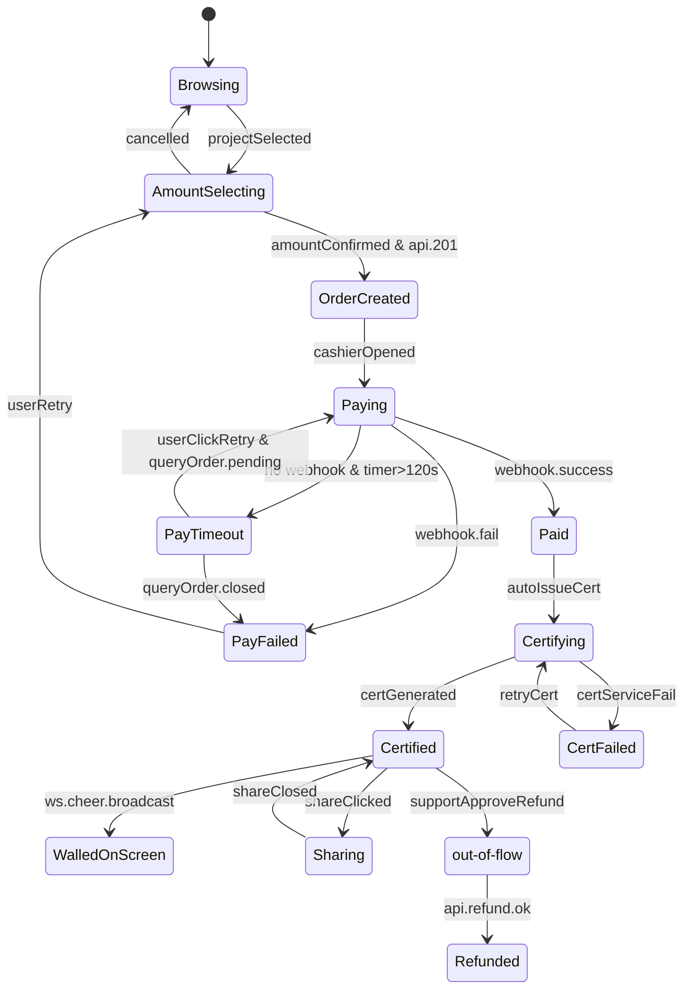

> Run: 2026-04-17-211321 | Phase: P3 | 作者: Hephaestus
> 契约来源: docs/ui/design-system.md + docs/ui/page-map.md
> M1 覆盖 US: US-014

# 状态机 · 捐赠大厅订单（Donation Hall State）

## 1. 状态拓扑图

## 2. 状态 / 事件 / 守卫 / 动作

| 状态 | 含义 |
|------|------|
| `Browsing` | 浏览项目列表/详情 |
| `AmountSelecting` | 项目详情内选择面值 |
| `OrderCreated` | 下单成功，订单号已生成 |
| `Paying` | 收银台已打开，等待回调 |
| `Paid` | 支付回调成功 |
| `PayFailed` | 支付明确失败 |
| `PayTimeout` | 超过 120s 未收到回调 |
| `Certifying` | 生成电子证书中 |
| `Certified` | 证书已生成并展示 |
| `Sharing` | 证书分享面板打开 |
| `WalledOnScreen` | 已广播到鸣谢大屏 |
| `Refunding` / `Refunded` | 退款流（仅客服后台触发） |

| 事件 | 守卫 | 动作 |
|------|------|------|
| `amountConfirmed` | 面值 ≥ 1 & 协议勾选（若有） | `POST /donations` 下单 |
| `cashierOpened` | `order.status=created` | 调起 `PaymentAdapter.createOrder`；启动 120s 倒计时 |
| `webhook.success` | 签名校验通过 & `order.amount` 一致 | 订单置 `paid`，触发证书生成 |
| `no webhook & timer>120s` | — | 主动 `GET /donations/:id` 查询；根据返回分叉 |
| `supportApproveRefund` | 客服后台审批通过 | `POST /refund` |

## 3. 与后端状态映射

| 前端态 | 后端 `order.status` |
|--------|--------------------|
| `OrderCreated` | `created` |
| `Paying` | `paying` |
| `Paid` | `paid` |
| `PayFailed` | `failed` 或 `closed` |
| `PayTimeout` | `paying`（时间窗超限）|
| `Certified` | `certified` |
| `WalledOnScreen` | `certified` + `cheer_broadcast_at != null` |
| `Refunded` | `refunded` |

## 4. 异常路径

1. **Webhook 丢失**：120s 轮询 `GET /donations/:id`；若后端仍 `paying` 则继续等待最多 10 分钟；仍未到账时引导"联系客服"。
2. **同订单重复回调**：前端对 `order_id` 维护幂等集合，已处理订单忽略再次 webhook 推送。
3. **证书生成失败**：展示 "证书生成中遇到问题，稍后系统将自动补发"；订单已付款不回退，后端定时任务重试 3 次。
4. **用户关闭收银台**：状态停留 `Paying`，允许从"我的订单"回到该订单重新拉起支付。
5. **网络断开中支付成功**：重新联网后通过 WS `donation.paid` 推送或进入页面时 `GET` 查询补齐状态。
6. **退款发起后用户仍在 `Sharing`**：WS 推送 `order.refunded` 后强制关闭分享面板，提示 "该订单已退款，证书失效"。
