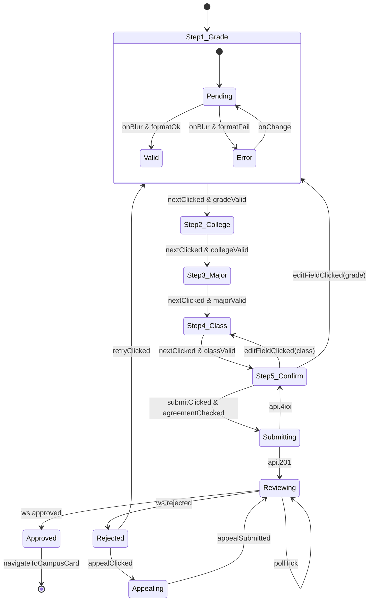

> Run: 2026-04-17-211321 | Phase: P3 | 作者: Hephaestus
> 契约来源: docs/ui/design-system.md + docs/ui/page-map.md
> M1 覆盖 US: US-006 / US-007

# 状态机 · 身份认证漏斗（Identity Onboarding State）

## 1. 状态拓扑图

每个子步骤内部均可复用上述 `Pending / Valid / Error` 三态。

## 2. 状态 / 事件 / 守卫 / 动作

| 状态 | 含义 |
|------|------|
| `Step1..Step5` | 5 步漏斗当前所在步骤 |
| `Submitting` | 提交 API 等待响应 |
| `Reviewing` | 工单进入审核队列，轮询 + WS |
| `Approved` | 审核通过，可激活电子校友卡 |
| `Rejected` | 审核驳回 |
| `Appealing` | 转人工申诉表单态 |

| 事件 | 守卫 | 动作 |
|------|------|------|
| `nextClicked` | 当前步字段通过 schema 校验 | 写入 localStorage 草稿 + 切换步骤 |
| `submitClicked` | 协议已勾选 | `POST /alumni/certifications` |
| `api.201` | — | 返回 `ticket_id`，跳转挂起页，启动 30s 轮询与 WS 订阅 |
| `ws.rejected` | `event.ticket_id === local.ticketId` | 停止轮询，展示驳回面板 |
| `retryClicked` | 驳回次数 < 5 | 保留未被驳回字段，回到 Step1 |
| `appealClicked` | — | 进入申诉表单，允许 512 字说明 + 附件 |

## 3. 与后端状态映射

| 前端态 | 后端 `certification.status` |
|--------|----------------------------|
| `Submitting` | — （网络往返中） |
| `Reviewing` | `pending` 或 `in_review` |
| `Approved` | `approved` |
| `Rejected` | `rejected`（携带 `reject_reason` + `reject_field`） |
| `Appealing` | `appeal_submitted` |

## 4. 异常路径

1. **提交接口超时**：Submitting 超过 15s 未响应 → Toast "提交超时，请重试" → 回到 Step5；不清空字段；重试次数 +1。
2. **重复提交**：若本地已有 `ticket_id` 且后端状态为 `pending`，禁用提交按钮并引导"前往查看审核进度"。
3. **WS 断开**：退化为 30s 轮询；连续 3 次轮询失败后展示"网络异常，已暂停自动更新，点击刷新"按钮。
4. **草稿损坏**：localStorage JSON 解析失败时清空草稿并回到 Step1，Toast 提示"草稿已失效，请重新填写"。
5. **驳回连续 ≥ 5 次**：强制进入 `Appealing`，禁用自助重填，引导客服介入。
6. **后端返回未知字段 `reject_field`**：高亮全部 5 步字段，展示通用"请核对以下所有信息"提示，避免定位错误。
