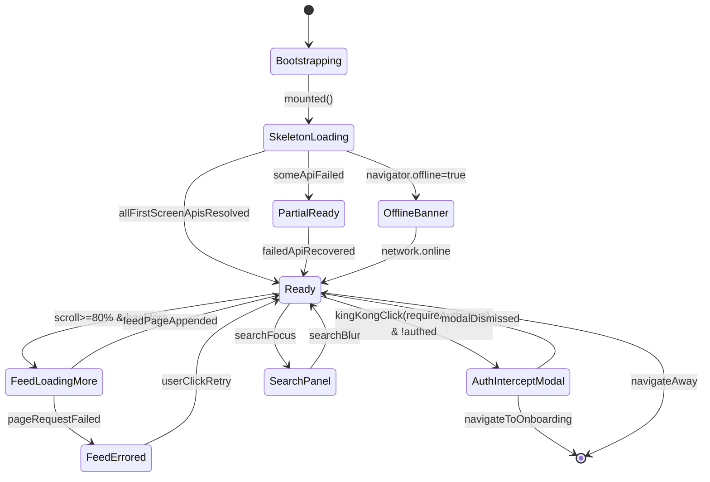

> Run: 2026-04-17-211321 | Phase: P3 | 作者: Hephaestus
> 契约来源: docs/ui/design-system.md + docs/ui/page-map.md
> M1 覆盖 US: US-001 / US-002

# 状态机 · 微门户首页（Portal Home State）

## 1. 状态拓扑图

## 2. 状态 / 事件 / 守卫 / 动作

| 状态 | 含义 |
|------|------|
| `Bootstrapping` | 首次挂载，读取本地缓存与用户 token |
| `SkeletonLoading` | Banner/金刚区/前 3 卡片骨架可见 |
| `Ready` | 首屏就绪 |
| `PartialReady` | 部分接口失败，允许用户使用已就绪模块 |
| `OfflineBanner` | 离线提示顶部横幅常驻 |
| `FeedLoadingMore` | 触发瀑布流分页加载 |
| `FeedErrored` | 分页请求失败，局部重试按钮 |
| `AuthInterceptModal` | 未认证访问受限入口的拦截弹窗 |
| `SearchPanel` | 搜索输入聚焦，下拉历史/推荐 |

| 事件 | 守卫 | 动作 |
|------|------|------|
| `mounted()` | — | 并发请求 banners / king-kong / news-feed?page=1 |
| `kingKongClick` | `entry.requireAuth && !authed` | 打开拦截弹窗并埋点 `portal_kingkong_click` |
| `scroll>=80%` | `hasMore && !loadingMore` | 请求 `news-feed?cursor=` |
| `pageRequestFailed` | — | Toast + 展示局部重试 |
| `searchFocus` | — | 展开 SearchPanel，拉历史记录 |
| `navigator.offline` | — | 顶部离线横幅，禁用拉新但保留缓存内容 |

## 3. 与后端状态映射

| 前端态 | 后端 / 网络含义 |
|--------|----------------|
| `Ready` | 全部首屏 API HTTP 200 |
| `PartialReady` | banners 或 king-kong 5xx，但 news-feed 成功（或反之） |
| `FeedErrored` | `/api/v1/public/portal/news-feed` 非 200 |
| `AuthInterceptModal` | 无 `Authorization` 或 401 响应携带 `code=IDENTITY_REQUIRED` |
| `OfflineBanner` | `navigator.onLine === false` 或连续 3 次请求超时 |

## 4. 异常路径

1. **全部首屏接口失败 + 离线**：进入 `OfflineBanner` 叠加"暂无缓存内容，请检查网络"占位页；CTA "刷新重试"。
2. **CDN 图片加载失败**：Banner 占位为纯色 + 标语文本 fallback；不阻塞骨架完成。
3. **金刚区配置 schema 不匹配**：前端校验失败时降级为内置默认入口列表，并上报埋点 `portal_kingkong_schema_invalid`。
4. **瀑布流分页请求连续失败 3 次**：停止自动触发，提示"加载失败，点击重试"，避免重试风暴。
5. **AuthInterceptModal 无法跳转（路由错误）**：回落至 Toast "请先完成身份认证" + 底部固定 CTA。
6. **SearchPanel 拉取历史接口失败**：本地退化为展示内置热门关键词（"校庆""捐赠""入校预约""活动报名"），不阻塞搜索主流程；埋点 `portal_search_history_failed` 上报。
7. **首屏 API 返回未知字段**：按 Schema 宽松模式忽略未知字段，防止前端崩溃；同时上报 `portal_schema_warning` 供后端回归。
