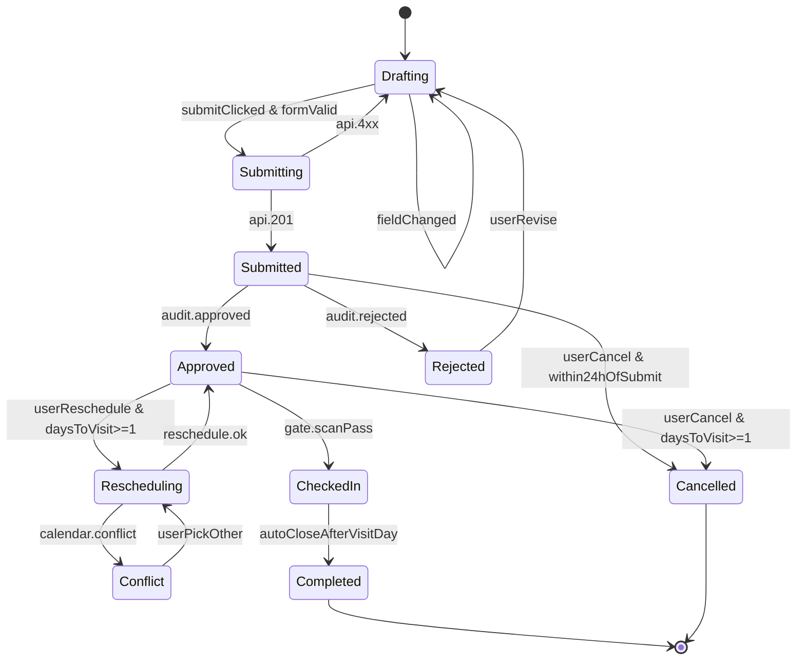

> Run: 2026-04-17-211321 | Phase: P3 | 作者: Hephaestus
> 契约来源: docs/ui/design-system.md + docs/ui/page-map.md
> M1 覆盖 US: US-015

# 状态机 · 一站式办事大厅预约（Workflow Hall State）

## 1. 状态拓扑图

## 2. 状态 / 事件 / 守卫 / 动作

| 状态 | 含义 |
|------|------|
| `Drafting` | 正在填写预约表单（含日期、时段、随行家属） |
| `Submitting` | 提交中 |
| `Submitted` | 已提交等待审核 |
| `Approved` | 审核通过，等待到校 |
| `Rejected` | 被驳回 |
| `Rescheduling` | 用户发起改签 |
| `Conflict` | 改签命中时间/名额冲突 |
| `CheckedIn` | 闸机已核验通过 |
| `Completed` | 访问日结束，工单关闭 |
| `Cancelled` | 用户主动取消 |

| 事件 | 守卫 | 动作 |
|------|------|------|
| `submitClicked` | 日期+时段+家属≤3+事由 ≥ 5 字 | `POST /appointments` |
| `userCancel` | `daysToVisit >= 1` & 状态 ∈ {Submitted, Approved} | `POST /appointments/:id/cancel` + 释放名额 |
| `userReschedule` | 状态 = Approved & `daysToVisit >= 1` | 调起改签日历 |
| `gate.scanPass` | QR 有效且 `visit_date === today` | 状态置 CheckedIn + 写 audit-log |
| `audit.rejected` | — | 提供 `reject_reason` + 驳回原因展示 |

## 3. 与后端状态映射

| 前端态 | 后端 `appointment.status` |
|--------|--------------------------|
| `Drafting` | — （本地） |
| `Submitted` | `submitted` 或 `pending_review` |
| `Approved` | `approved` |
| `Rejected` | `rejected` |
| `CheckedIn` | `checked_in` |
| `Completed` | `completed` |
| `Cancelled` | `cancelled` |
| `Rescheduling` | `approved`（带 `reschedule_request=true`）|

## 4. 异常路径

1. **时间冲突**：提交时后端返回 `409 CONFLICT_TICKET`（同用户当日已有未完成工单），前端回到 Drafting 并红色高亮日期。
2. **名额已满**：后端返回 `409 SLOT_FULL`，前端强制刷新日历余量并清空所选日期。
3. **家属身份证被黑名单命中**：后端返回 `403 COMPANION_BLACKLIST`，提示 "随行家属 X 无法核验，请联系校友会"。
4. **改签距访问日 < 24 小时**：前端 CTA 禁用；若用户强行调用接口，后端返回 `403 RESCHEDULE_DEADLINE_EXCEEDED`。
5. **闸机扫码时令牌过期**：闸机 Adapter 返回 `TOKEN_EXPIRED`，引导用户在现场打开电子校友卡刷新 QR 后重试。
6. **网络断连改签半途**：本地草稿保留所选新日期；联网后弹出确认 "是否继续改签至 2026-04-22？"。
