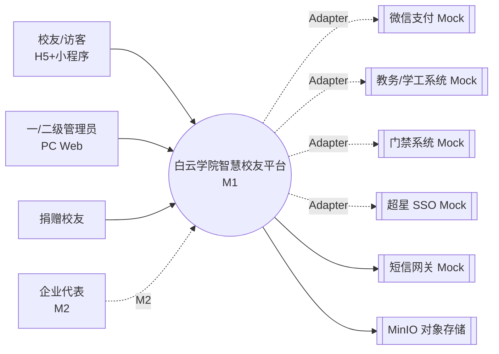
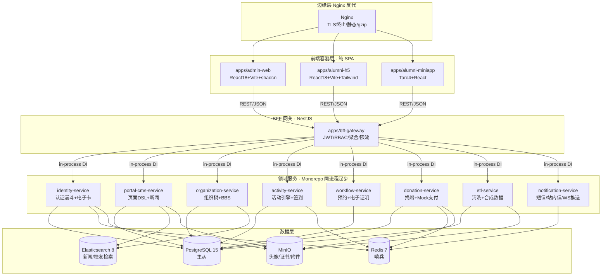

# P2 架构蓝图 — 白云学院超星智慧校友服务平台

> Run ID: 2026-04-17-211321 | 阶段: P2 | 作者: Prometheus | 输入: P1 Metis 意图输出 + 用户批准决策集
> 约束: Greenfield / 严格前后端分离 / 禁用 Docker / M1 无 AI / Windows 11 / 海军蓝 Token 冻结

---

## 1. 系统架构总图

### 1.1 C4 Level 1 — Context



### 1.2 C4 Level 2 — Container（M1 推荐形态）



### 1.3 通信形态决策

- **M1 起步**：8 个领域服务以 **NestJS 多模块同进程** 部署（单个 Node 进程内通过 DI 调用），由 `bff-gateway` 统一暴露 HTTP。理由：节省运维成本、Windows + PM2 单进程稳态、无分布式事务复杂度。
- **M2 拆分锚点**：保留 `@Injectable` + 显式接口边界（`IIdentityService` 等），代码层面已解耦；拆分时将 `in-process DI` 替换为 **NestJS Microservices（TCP Transport）** 或 gRPC，无需改业务代码。
- **异步任务**：Redis Stream 作为轻量消息总线（ETL 任务、捐赠回调、活动推送），避免引入 Kafka/RabbitMQ。
- **实时推送**：`notification-service` 内置 WebSocket（Socket.io）+ Redis Adapter，支撑捐赠鸣谢大屏与活动大屏。

---

## 2. 技术分层与目录结构

采用 **pnpm workspaces + Turborepo**（理由见 §9 决策日志）。根目录：`i:\CustomBuild\Other\baiyunu-school\`

```
i:\CustomBuild\Other\baiyunu-school\
├── apps/
│   ├── admin-web/              # PC 管理端 SPA（React18+Vite+shadcn）
│   ├── alumni-h5/              # H5 校友端 SPA（React18+Vite+Tailwind）
│   ├── alumni-miniapp/         # 微信小程序（Taro 4）
│   ├── bff-gateway/            # NestJS BFF（对外 HTTP 入口）
│   └── server/                 # NestJS 领域服务聚合进程（M1 单体）
├── services/                   # 领域模块（被 apps/server 装配）
│   ├── identity/
│   ├── portal-cms/
│   ├── organization/
│   ├── activity/
│   ├── workflow/
│   ├── donation/
│   ├── etl/
│   └── notification/
├── packages/
│   ├── contracts/              # OpenAPI 3.1 yaml + 生成的 TS types + Zod schemas
│   ├── ui/                     # 共享 React 组件（shadcn 二次封装）
│   ├── design-tokens/          # Token → CSS vars + Tailwind preset + 小程序 wxss
│   ├── adapters/               # 外部系统 Adapter 接口 + Mock 实现
│   │   ├── payment/
│   │   ├── edu-system/
│   │   ├── stu-affairs/
│   │   ├── access-control/
│   │   ├── chaoxing-sso/
│   │   └── e-sign/
│   ├── domain/                 # 领域模型（实体/值对象/枚举，纯 TS）
│   ├── db/                     # Prisma schema + 迁移 + 种子
│   ├── auth/                   # JWT/RBAC 共享逻辑
│   ├── logger/                 # Pino + OTel 封装
│   ├── config/                 # 环境配置 + Zod 校验
│   └── test-utils/             # 测试夹具/工厂/数据库沙箱
├── tools/
│   ├── scripts/                # PowerShell 运维脚本（start.ps1/reset-db.ps1）
│   └── codegen/                # OpenAPI → TS 生成器
├── tests/
│   ├── e2e-web/                # Playwright（PC + H5）
│   ├── e2e-miniapp/            # miniprogram-automator
│   ├── api/                    # newman Postman 集合
│   └── perf/                   # autocannon 脚本
├── .sisyphus/                  # 管线产物（只读区）
├── docs/                       # PRD/Epic/UI（只读契约）
├── turbo.json
├── pnpm-workspace.yaml
├── package.json
├── tsconfig.base.json
├── .eslintrc.cjs
├── .prettierrc
└── README.md
```

**Node 版本**：`.nvmrc` 锁定 `20.11.x`；pnpm 锁定 `9.x`。

---

## 3. 数据模型（核心 15 表）

使用 **Prisma 5** 作为 ORM（迁移 + 类型生成）；schema 位于 `packages/db/prisma/schema.prisma`。

| # | 表名 | 关键字段 | PG 特性 | 索引 |
|---|---|---|---|---|
| 1 | `alumni_profile` | `id uuid PK`, `user_id`, `name_enc bytea`, `id_card_enc bytea`, `phone_enc bytea`, `year int`, `college_id`, `dept_id`, `class_id`, `avatar_url`, `status enum(active/frozen)` | pgcrypto AES-GCM（`_enc` 字段） | `(year,college_id)`, `GIN` on 姓名拼音 |
| 2 | `alumni_application` | `id uuid`, `applicant_name`, `payload jsonb`, `status enum(pending/approved/rejected/supplement)`, `reviewer_id`, `reviewed_at`, `evidence_urls text[]` | JSONB 存 5 级选择器快照 | `(status, created_at)` |
| 3 | `alumni_card` | `id uuid`, `alumni_id FK`, `card_no`, `qr_secret bytea`, `rotation_sec int default 30`, `issued_at`, `revoked_at` | 动态 QR 种子加密存储 | `unique(card_no)` |
| 4 | `organization_node` | `id`, `parent_id`, `name`, `type enum(校级/院级/系级/班级/分会)`, `meta jsonb` | + `organization_closure(ancestor,descendant,depth)` 闭包表 | 闭包表 `(ancestor,depth)` |
| 5 | `post` | `id`, `org_node_id`, `author_id`, `title`, `content_md`, `pinned bool`, `visibility enum`, `created_at` | 全文检索同步 ES | `(org_node_id, pinned desc, created_at desc)` |
| 6 | `activity` | `id`, `title`, `template_id`, `dsl jsonb`（微流 DAG）, `quota int`, `start_at`, `end_at`, `status`, `creator_id` | JSONB + GIN | `(status, start_at)` |
| 7 | `activity_enrollment` | `id`, `activity_id`, `alumni_id`, `form_data jsonb`, `qr_ticket`, `check_in_at`, `status enum(enrolled/checked/cancelled)` | 分布式锁通过 Redis 保证名额 | `unique(activity_id, alumni_id)` |
| 8 | `reservation` | `id`, `alumni_id`, `service_type enum(返校/证明/档案)`, `slot_date`, `slot_time`, `companions jsonb`, `status`, `qr_ticket` | 时间槽唯一 | `unique(service_type, slot_date, slot_time, alumni_id)` |
| 9 | `donation_order` | `id`, `alumni_id nullable`, `amount_cents bigint`, `channel enum(wechat/alipay/mock)`, `status enum(init/paid/failed/refunded)`, `out_trade_no unique`, `paid_at`, `message`, `anonymous bool` | 分区：按 `created_at` 按月分区 | `(status, paid_at)` |
| 10 | `donation_wall_entry` | `id`, `order_id FK`, `display_name`, `amount_cents`, `created_at` | 物化视图同步前端大屏 | `(created_at desc)` |
| 11 | `etl_job` | `id`, `source enum(教务/学工/花名册)`, `type enum(full/incremental)`, `status`, `stats jsonb`, `started_at`, `finished_at` | JSONB 存清洗统计 | `(status, started_at)` |
| 12 | `etl_staging` | `id`, `job_id`, `raw jsonb`, `normalized jsonb`, `error_code`, `dedupe_key` | JSONB + 唯一键去重 | `unique(dedupe_key)` |
| 13 | `portal_page` | `id`, `slug unique`, `title`, `dsl jsonb`（页面 DSL）, `version int`, `published bool`, `published_at` | JSONB + 版本号乐观锁 | `unique(slug, version)` |
| 14 | `portal_template` | `id`, `name`, `category`, `thumbnail_url`, `dsl jsonb`, `builtin bool` | 系统模板 + 用户模板 | `(category, builtin)` |
| 15 | `audit_log` | `id`, `actor_id`, `action`, `target_type`, `target_id`, `payload jsonb`, `ip`, `ua`, `created_at` | **按月 RANGE 分区**（180d 留存） | `(actor_id, created_at)` |

### 3.1 敏感字段加密

- PG 扩展：`pgcrypto` + `pg_trgm` + `uuid-ossp`
- 加密层：`packages/db/src/crypto.ts` 提供 `encryptAesGcm(key, plaintext)`，KEK 由 `config` 从环境变量加载，`alumni_profile` 保存 DEK 密文（KMS 抽象预留）
- 检索兼容：姓名保留 `name_pinyin text` 明文用于搜索，身份证以 `id_card_hash bytea`（SHA-256+salt）做查重

### 3.2 ES 索引

- `idx_alumni`：姓名/拼音/年级/院系/班级（ik_smart 分词）
- `idx_news`：标题/正文/分类/标签
- `idx_post`：话题帖子

---

## 4. API 契约策略

### 4.1 OpenAPI 3.1 驱动

- 单一事实源：`packages/contracts/openapi/*.yaml`（按服务拆分）
- 代码生成：`tools/codegen/gen.ts` 调用 `openapi-typescript` → `packages/contracts/src/types/*.d.ts`
- 服务端校验：`packages/contracts/src/zod/*.ts`（由 `ts-to-zod` 同步生成）
- NestJS DTO：使用 `nestjs-zod` 将 Zod schema 直接作为 DTO + ValidationPipe

### 4.2 路径约定

| 前缀 | 用途 | 鉴权 |
|---|---|---|
| `/api/v1/public/*` | 门户新闻、轮播、捐赠大屏 WS 等匿名可访问 | 无 |
| `/api/v1/alumni/*` | 校友端业务（电子卡、活动、预约、捐赠） | JWT access token |
| `/api/v1/admin/*` | 管理端（装修器、ETL、审批、组织） | JWT + RBAC 角色校验 |
| `/api/v1/webhook/*` | 支付回调、第三方推送 | 签名校验中间件 |
| `/internal/*` | 健康检查、metrics | 仅内网 + token |

### 4.3 认证与 RBAC

- 校友端：`access_token`（15 min）+ `refresh_token`（30 d，Redis 黑名单支持撤销）
- 管理端：同双 Token，额外携带 `roles: string[]`，`Permissions` 存 Redis（角色→动作码矩阵）
- RBAC 装饰器：`@RequirePerm('portal:page:publish')`
- 角色草案（§6.2 展开）：`super-admin / portal-admin / identity-reviewer / activity-runner / donation-ops / org-admin / readonly`

### 4.4 错误规范（RFC 7807 Problem Details）

```json
{
  "type": "https://bynu.example.com/errors/validation-failed",
  "title": "Validation Failed",
  "status": 422,
  "detail": "身份证号格式错误",
  "instance": "/api/v1/alumni/applications",
  "traceId": "01HV...",
  "errors": [{"field":"idCard","code":"INVALID_FORMAT"}]
}
```

全局异常过滤器：`packages/logger/src/filters/problem-details.filter.ts`。

### 4.5 版本化

- URL Path Versioning（`/v1/`）
- 弃用策略：通过 `Deprecation` + `Sunset` 响应头提前 2 个 minor 版本通知
- 小程序端强制升级：响应头 `X-Min-Client-Version` 触发 UI 升级弹窗

---

## 5. 适配层（Adapter）清单

所有 Adapter 位于 `packages/adapters/<name>/`，结构统一：

```
packages/adapters/<name>/
├── src/
│   ├── interface.ts     # 抽象接口（领域词汇）
│   ├── mock.ts          # Mock 实现（M1 默认）
│   ├── real.ts          # 真实实现（预留，M2+）
│   ├── factory.ts       # 根据 config 返回实例
│   └── index.ts
└── tests/
```

| Adapter | 接口关键方法 | M1 Mock 行为 | 切换标志 |
|---|---|---|---|
| **PaymentAdapter** | `createOrder(amount, channel, meta)` / `queryOrder(outTradeNo)` / `refund(orderId, amount)` / `verifyWebhook(headers, body)` | 内存 + Redis 模拟订单，2s 后主动 POST 回调到 `donation-service` | `PAYMENT_PROVIDER=mock\|wechat_v3\|alipay` |
| **EduSystemAdapter** | `queryAlumni(idCard)` / `listGraduates(year)` / `verifyEnrollment(payload)` | 从 `packages/adapters/edu-system/fixtures/*.json`（faker 合成 5000 人）读取 | `EDU_PROVIDER=mock\|rest_api\|file_import` |
| **StuAffairsAdapter** | `queryDiscipline(idCard)` / `queryAwards(idCard)` | 合成数据 | `STU_PROVIDER=mock\|real` |
| **AccessControlAdapter** | `pushWhitelist(alumniId, slotDate)` / `revokeWhitelist(id)` / `verifyTicket(qr)` | 内存列表 + 日志 | `ACL_PROVIDER=mock\|wiegand_http` |
| **ChaoxingSsoAdapter** | `buildAuthUrl(state)` / `exchangeToken(code)` / `listCourses(userId)` | 返回固定测试用户 + 静态课程 JSON | `CHAOXING_PROVIDER=mock\|oauth2` |
| **ESignAdapter** | `createSignTask(pdfBytes, signer)` / `queryTask(taskId)` / `downloadSigned(taskId)` | 为 PDF 添加可视化水印 + SHA-256 哈希写入 MinIO | `ESIGN_PROVIDER=mock\|fadada\|esign_cn` |

**注入方式**：NestJS `Provider` + `useFactory`，服务层仅依赖 `I<Name>Adapter` 抽象；切换无需改业务代码。

---

## 6. 非功能指标量化

### 6.1 容量与性能

| 指标 | M1 目标 | 验证方法 |
|---|---|---|
| 并发在线 | 1,000 校友端 + 50 管理端 | `autocannon -c 100 -d 60` × 10 路径 |
| 峰值 QPS | 200（业务）+ 500（静态） | 同上；Nginx 静态由压测独立覆盖 |
| API P95 延迟 | `< 500ms`（非大屏聚合） / `< 1s`（大屏聚合） | `tests/perf/` 基线化，每 PR 对比 |
| WebSocket 广播 | 捐赠鸣谢 2,000 并发连接，消息延迟 `< 2s` | `artillery-socketio` 脚本 |
| SLA | 99.5%（M1 单机） | 正常维护窗口外计算 |
| 数据库连接池 | 业务 50 / BFF 30 | Prisma `connection_limit` |

### 6.2 安全

- **敏感字段矩阵**（个保法对齐）：

| 字段 | 分级 | 存储 | 展示 |
|---|---|---|---|
| 姓名 | 一般 | 明文 + pinyin | 管理端全量 / 公开脱敏"张**" |
| 身份证 | 敏感 | AES-GCM + hash | 不展示；审批端仅展示后 4 位 |
| 手机号 | 敏感 | AES-GCM | 脱敏"138****1234" |
| 头像 | 一般 | MinIO 私桶 + 签名 URL 10 min | — |
| 捐赠金额 | 公开 | 明文 | 捐赠者默认匿名，显式勾选公开 |

- **RBAC 权限码草案**：`portal:page:*` / `identity:application:review` / `activity:publish` / `donation:refund` / `org:node:manage` / `etl:job:trigger` / `admin:user:manage` / `audit:read` 等约 40 条
- **审计日志**：所有 `/admin/*` POST/PUT/DELETE 强制落 `audit_log`，180 天分区自动归档到 MinIO
- **防御基线**：Helmet / CORS 白名单 / CSRF（双 Token 策略）/ 请求体积上限 / 速率限制（Redis + `@nestjs/throttler`）

### 6.3 容灾与备份

- **PostgreSQL**：`primary + replica`（流复制），每日全量 + WAL 增量到 MinIO `backup/pg/` 桶
- **Redis**：哨兵 3 节点（同机多端口 M1 起步）+ RDB 每 5 min，AOF everysec
- **MinIO**：纠删码（M1 单机 `EC:2`），跨盘冗余
- **恢复演练**：`tools/scripts/dr-restore.ps1` 月度演练脚本

### 6.4 可观测

- **日志**：Pino JSON → 本地文件按天切分 → Loki（后续阶段接入）
- **Trace**：OpenTelemetry SDK，BFF 入口生成 `traceId`，贯穿日志 + Problem Details
- **Metrics**：`@willsoto/nestjs-prometheus` 暴露 `/internal/metrics`，Grafana 看板模板位于 `tools/scripts/grafana/`
- **健康检查**：`/internal/health`（liveness）+ `/internal/ready`（依赖 PG/Redis/ES）

---

## 7. 阶段化交付计划（M1）

### Phase 映射总览

| Phase | 目标 | 涉及 US | 涉及服务 | 涉及页面 | 并行度 |
|---|---|---|---|---|---|
| **1a** | 骨架与脚手架 | — | monorepo 全量 / CI | Design Token 落地 / 健康页 | 串行（先决） |
| **1b** | 身份认证闭环 | US-006/007/008 | identity / notification / etl（合成数据） | 认证漏斗 5 步 / 电子校友卡 / 审批台 | 1b + 1c 可并行 |
| **1c** | 门户 + 装修器 + 新闻 | US-001/002 | portal-cms | 门户首页 / 装修器 / 新闻列表详情 | 与 1b 并行 |
| **1d** | 组织树 + BBS + 办事大厅 | US-010/015 | organization / workflow | 组织架构图 / 话题流 / 预约日历 / 电子证明 | 依赖 1b；与 1e 可并行 |
| **1e** | 活动引擎 + 签到 | US-011/012 | activity / notification | 活动列表 / DSL 编辑器 / 扫码签到 / 活动大屏 | 依赖 1b |
| **1f** | 捐赠 + Mock 支付 + 鸣谢大屏 + 数据看板 | US-014 | donation / notification | 面值气泡 / 支付跳转 / 大屏 / 基础看板 | 依赖 1a；与 1d/1e 并行 |

**关键路径**：`1a → 1b → {1d, 1e} → 冒烟`；`1c`、`1f` 全程并行。

### 各 Phase 验收证据路径

`.sisyphus/runs/2026-04-17-211321/qa/<phase>/{unit,integration,e2e,api,visual,perf}/`

---

## 8. Phase 1a 任务包

共 13 条原子任务，供 Hephaestus 领取。

| ID | WHERE | WHY | HOW | EXPECTED | 依赖 | 验收命令 |
|---|---|---|---|---|---|---|
| **T-1a-01** | `/pnpm-workspace.yaml` `/package.json` `/turbo.json` `/tsconfig.base.json` | Monorepo 根 | pnpm init + workspaces 声明 `apps/*` `services/*` `packages/*`；turbo pipeline：`build/test/lint/typecheck` | `pnpm -v` + `turbo --version` 可用 | — | `pnpm install; pnpm turbo run build --dry=json` |
| **T-1a-02** | `/.editorconfig` `/.eslintrc.cjs` `/.prettierrc` `/.gitignore` `/.nvmrc` | 质量基线 | 采用 `@typescript-eslint/strict-type-checked` + prettier；`.nvmrc`=`20.11.1` | `pnpm lint` 全绿 | T-1a-01 | `pnpm lint; pnpm format:check` |
| **T-1a-03** | `packages/design-tokens/` | Token 落地（冻结） | 读取 `docs/ui/design-system.md` 生成：`tokens.css`（CSS vars）/ `tailwind.preset.ts` / `miniapp.wxss` / `tokens.json` | 三端引用同一来源；diff 与 docs 0 差异 | T-1a-01 | `pnpm --filter @bynu/design-tokens test` |
| **T-1a-04** | `packages/contracts/` | OpenAPI 骨架 | 建立 `openapi/health.yaml`；codegen 脚本 `tools/codegen/gen.ts` | `pnpm gen:api` 产出 types | T-1a-01 | `pnpm gen:api; pnpm --filter @bynu/contracts typecheck` |
| **T-1a-05** | `packages/db/prisma/schema.prisma` `packages/db/src/` | 数据层骨架 | 定义 15 张表（§3）；迁移 `0001_init.sql`；pgcrypto 扩展 | 本地 PG 迁移成功 + 种子 5 用户 | T-1a-01 | `pnpm db:migrate; pnpm db:seed; pnpm db:verify` |
| **T-1a-06** | `packages/adapters/*/` | Adapter 骨架 | 6 个 Adapter 接口 + Mock 空实现 + factory；读 `PAYMENT_PROVIDER` 等环境变量 | 所有 Adapter 单测通过 | T-1a-01 | `pnpm --filter "./packages/adapters/*" test` |
| **T-1a-07** | `apps/server/` `services/*/` | NestJS 主进程 | `server` 聚合 8 个 `*.module.ts`（空 Controller 各一）；Pino + OTel + Prometheus | `curl /internal/health` 返回 200 | T-1a-05 T-1a-06 | `pnpm start:server & sleep 3; curl -f http://localhost:3000/internal/health` |
| **T-1a-08** | `apps/bff-gateway/` | BFF 入口 | NestJS + JWT 策略骨架 + RBAC 装饰器 + 全局 Problem Details 过滤器 | `/api/v1/public/health` 200；未授权 `/api/v1/admin/*` 返回 401 | T-1a-07 | `pnpm test:e2e -- --grep "bff health"` |
| **T-1a-09** | `apps/admin-web/` | PC 管理端骨架 | Vite + React18 + shadcn + 引入 `@bynu/design-tokens` preset；路由 `/login /dashboard` 占位 | `pnpm dev` 启动，Lighthouse A11y>90 | T-1a-03 | `pnpm --filter admin-web build; pnpm --filter admin-web lighthouse:ci` |
| **T-1a-10** | `apps/alumni-h5/` | H5 校友端骨架 | Vite + React18 + Tailwind preset；路由 `/home /card /login` 占位 | 同上 | T-1a-03 | 同 T-1a-09 |
| **T-1a-11** | `apps/alumni-miniapp/` | 小程序骨架 | Taro 4 init；接入 `design-tokens/miniapp.wxss`；Tab：首页/电子卡/我的 | `pnpm --filter alumni-miniapp build:weapp` 成功 | T-1a-03 | `pnpm --filter alumni-miniapp build:weapp` |
| **T-1a-12** | `.github/workflows/ci.yml` 或 `tools/scripts/ci.ps1`（因本地优先，提供 ps1） | CI 管线 | lint → typecheck → unit → build → e2e-smoke；产物归档到 `.sisyphus/runs/*/qa/` | 全绿 | 前 11 项 | `pwsh tools/scripts/ci.ps1` |
| **T-1a-13** | `tools/scripts/start.bat` `reset-db.bat` `stop.bat` | 一键脚本 | Windows BAT，中文提示；PG/Redis 依赖检查；PM2 守护 | 双击 `start.bat` 全栈可访问 | T-1a-07..11 | `cmd /c tools\scripts\start.bat; timeout /t 10; curl http://localhost/` |

**Phase 1a 完成定义（DoD）**：
1. `pwsh tools/scripts/ci.ps1` 全绿
2. 双击 `start.bat` 后：`http://localhost/`（H5）、`http://localhost/admin/`（PC）、小程序开发者工具预览 3 端均加载
3. `/internal/health` 返回所有依赖状态 `ok`
4. Token 三端 diff 为空

---

## 9. 风险更新 + 决策日志

### 9.1 风险增补（P1 R1~R6 + P2 新增 R7~R11）

- **R7 Monorepo 构建爆炸**：Turborepo 增量缓存失效将导致 CI 超时 → 缓解：分层缓存 + `turbo.json` 精确 `inputs/outputs`；CI 先跑受影响包（`--filter=...[HEAD^]`）
- **R8 Windows + PM2 单进程 SPOF**：Node 崩溃全平台下线 → 缓解：PM2 cluster mode 4 实例 + 滚动重启；关键异步任务走 Redis Stream 持久化可重放
- **R9 Prisma 对 PG 分区表支持弱**：`audit_log` 分区迁移 → 缓解：使用原生 SQL 迁移 + Prisma `@@map` 到视图
- **R10 小程序 Taro 4 与 shadcn 样式割裂**：`design-tokens` 需双通道产出 → 已在 T-1a-03 强制约束；新增视觉回归集
- **R11 Adapter Mock 数据与真实契约漂移**：后期对接教务/支付时失真 → 缓解：Adapter 接口附带 `@example` JSON schema；M2 切换时 golden test 自动比对

### 9.2 关键决策日志

| # | 决策 | 选项 | 结论 | 理由 |
|---|---|---|---|---|
| D-1 | Monorepo 工具 | Nx / Turborepo / Rush | **Turborepo + pnpm** | 对 Node 生态零侵入；Nx 插件链重且偏意见；Rush 偏企业级冗余 |
| D-2 | 起步部署形态 | 多进程微服务 / 单进程模块化 | **单进程模块化** | Windows 运维简单；代码接口已解耦，M2 可拆 |
| D-3 | ORM | Prisma / TypeORM / Drizzle | **Prisma** | 类型推导完善；迁移工具链成熟；唯一痛点分区用原生 SQL |
| D-4 | API 契约源 | 代码优先（Swagger）/ 契约优先（OpenAPI） | **契约优先 OpenAPI** | 前后端同构类型；对齐 `@bynu/contracts` 单一事实源 |
| D-5 | 组织树存储 | 邻接表 / 路径枚举 / 闭包表 / ltree | **闭包表**（邻接表辅助） | 无限深度 + 祖先查询 O(1)；符合 US-010 纵向可视化 |
| D-6 | 消息总线 | Kafka / RabbitMQ / Redis Stream | **Redis Stream** | 已有 Redis；M1 吞吐足够；避免新中间件 |
| D-7 | 前端状态 | Redux / Zustand / Jotai / TanStack Query | **TanStack Query + Zustand** | 服务端状态与客户端状态分离；体积小；学习曲线平 |
| D-8 | 表单 | react-hook-form / Formik | **react-hook-form + Zod** | 与 `@bynu/contracts` Zod 复用 |
| D-9 | 小程序路径 | 原生 / UniApp / Taro | **Taro 4**（已批准） | React 语法同构；未来可编译 H5/支付宝 |
| D-10 | 分布式锁 | PG advisory / Redis Redlock / Redisson | **Redis SET NX + Lua 续期** | 活动名额场景足够；简单可控 |

---

## 10. P3~P8 后续管线建议

### 10.1 Oracle 待审查决策点（优先级降序）

1. **单进程模块化 vs 微服务拆分阈值**（D-2）：确认 M2 的拆分触发条件（QPS/团队规模）
2. **敏感字段加密方案**（§6.2）：KEK 托管方式（环境变量 vs Windows DPAPI vs 外部 KMS）
3. **PG 分区 + Prisma 混合**（R9）：评估是否改用 Drizzle 以原生支持分区
4. **RBAC 权限码粒度**（§4.3）：40 条是否过细/过粗，是否引入 ABAC
5. **Redis Stream 幂等与重放策略**（D-6）：消费者组偏移与死信队列设计
6. **捐赠鸣谢 WebSocket 扩容**（§6.1）：2000 连接在 Windows Node 单实例的可行性
7. **Token 加密 QR 轮转节奏**（US-008）：30s 是否足够防截图
8. **ES 与 PG 的同步一致性**（§3.2）：CDC（pg_logical）vs 应用层双写

### 10.2 P3 UI 设计阶段调用序列

```powershell
# 前置：先让 @librarian 补 E-6 白云学院 VI（如未解封，默认沿用 design-system.md）
# Step 1 — MASTER
python scripts/search.py "higher education alumni community service platform warm trustworthy honor" --design-system --persist -p "Baiyunu Alumni Platform"

# Step 2 — 页面级 override（按优先级）
python scripts/search.py "digital id card membership badge animated anti-screenshot" --page alumni-card --persist -p "Baiyunu Alumni Platform"
python scripts/search.py "donation fundraising honor wall celebration scrolling marquee" --page donation --persist -p "Baiyunu Alumni Platform"
python scripts/search.py "alumni portal home news waterfall module builder" --page portal-home --persist -p "Baiyunu Alumni Platform"
python scripts/search.py "multi-step form wizard onboarding identity verification" --page identity-onboarding --persist -p "Baiyunu Alumni Platform"
python scripts/search.py "service workflow hall reservation calendar campus revisit" --page workflow-hall --persist -p "Baiyunu Alumni Platform"
python scripts/search.py "event engine drag-drop form builder DAG flow" --page activity-engine --persist -p "Baiyunu Alumni Platform"
python scripts/search.py "admin dashboard data visualization alumni analytics" --page admin-dashboard --persist -p "Baiyunu Alumni Platform"

# Step 3 — Token diff 对齐
pnpm --filter @bynu/design-tokens diff:docs
```

**冻结契约**：Primitive Token 不得被生成内容覆盖；生成结果落 `.sisyphus/runs/2026-04-17-211321/design-system/`，由编排者合并至 `packages/design-tokens/overrides/`。

### 10.3 P4~P8 Phase 映射

| 管线阶段 | 映射 M1 Phase | 关键门控 |
|---|---|---|
| **P4 骨架实现** | Phase 1a | T-1a 全部 13 任务；`ci.ps1` 全绿 |
| **P5 功能实现 A** | Phase 1b + 1c（并行） | 身份认证闭环 E2E + 门户装修器 E2E |
| **P6A 功能实现 B** | Phase 1d + 1f（并行） | 组织/办事 + 捐赠大屏 |
| **P6B 功能实现 C** | Phase 1e | 活动引擎 + 签到 |
| **P7 集成 QA** | 全栈 E2E + 压测 + 视觉回归 | `.sisyphus/runs/*/qa/` 全 6 类证据齐 |
| **P8 交付** | 一键脚本 + 运维手册 + 运行簿 | `start.bat` / `reset-db.bat` / `dr-restore.ps1` + Grafana 看板 JSON |

---

## TL;DR

- **核心目标**：为 Greenfield 智慧校友平台锁定技术骨架、数据契约、Adapter 边界与 Phase 1a 原子任务包，确保 P3~P8 可并行、可验收、无人工干预。
- **交付物**：系统架构（C4 双层）+ Monorepo 目录 + 15 表数据模型 + OpenAPI 驱动契约 + 6 Adapter + 量化 NF + 6 Phase 分解 + 13 任务 Phase 1a + 10 决策日志 + 后续管线清单。
- **蓝图类型**：系统架构 + 联调编排 + 文件级改造方案复合
- **深度级别**：L3 完整蓝图

## 待确认项

- `<待确认：真实支付商户号与小程序主体备案周期（E-2/E-3），是否影响 M1 上线边界>`
- `<待确认：Oracle 对 D-2（单进程模块化）在 1k 并发下的容量结论>`
- `<待确认：生产部署环境最终形态（单机 vs 主备 vs 云主机），影响 §6.3 容灾方案>`
- `<假设：Windows 11 生产机规格 ≥ 16C/32G/SSD 1T，PG/Redis/ES 同机共存>`

## 反馈

- 本蓝图为 **L3 完整执行蓝图**，覆盖系统架构 + 协同链路 + 文件级改造三类对象。
- 已明确：技术栈/目录/数据模型/契约策略/Adapter/NF 量化/Phase 分解/Phase 1a 13 条原子任务。
- 占位符集中在：生产部署形态、商户号/主体备案节奏、Oracle 容量复核三项外部依赖。
- 下一轮用户最适合补充：①是否接受 Turborepo+单进程起步（D-1/D-2）；②生产部署目标机配置；③Phase 1a 是否按 13 任务直接下发 Hephaestus；④是否先跑 P3 UI 生成再进 P4 实现（推荐）。